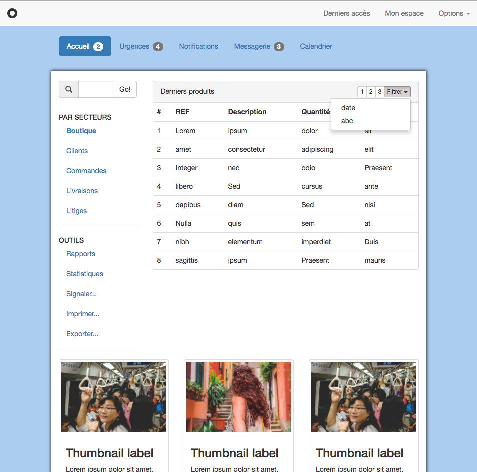
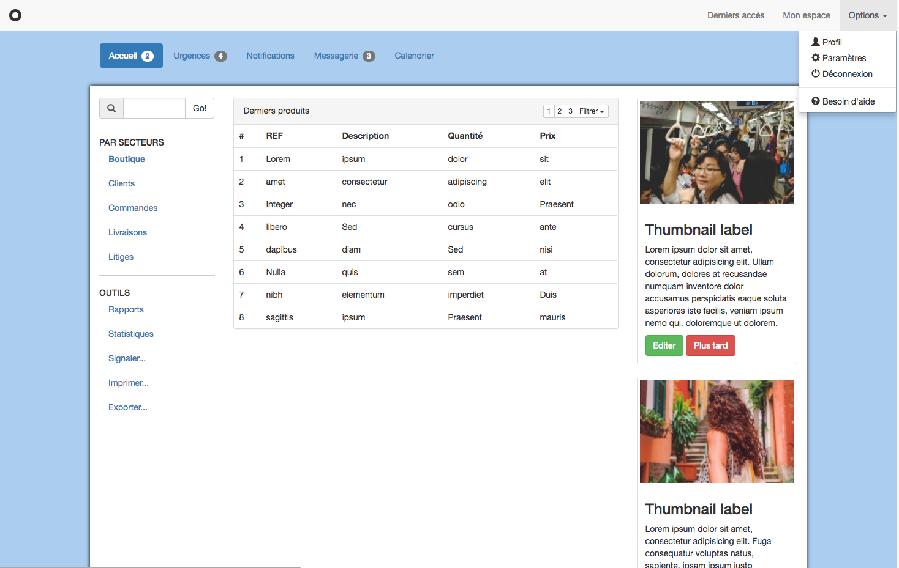

# Challenge S8-J2a
Intitulé : **Un dashboard avec Bootstrap 4**  
https://github.com/O-clock-Explorer/s05-e07-parcours-pdo-poo-GuillaumeD84  
*Inversion des dossiers principaux sur le GitHub de O'Clock - Explorer avec le repo S8-J2b*

Guillaume DURAND  
Promo : Explorer  
S8-J2 | 21/11/2017

Formateur : Jean-Christophe  
Type : Bootstrap

## Objectif
Créez une page HTML "dashboard" à laquelle on ajoutera Bootstrap, puis utiliserer les classes Bootstrap qui conviennent pour obtenir le rendu demandé.

## Résultat
Tablette (format "medium")

Ordinateur (format "large")

